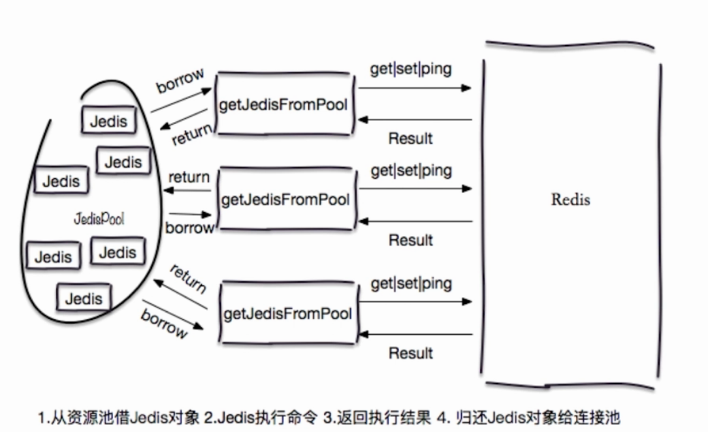

# redis客户端 jedis
---
##直连

##连接池

```java
public class PoolTest
{
    public static void main(String[] args)
    {
        Jedis jedis = null;
        GenericObjectPoolConfig config = new GenericObjectPoolConfig();
        JedisPool jedisPool = new JedisPool(config,"localhost");
        try
        {
            jedis = jedisPool.getResource();
            String hello = jedis.get("hello");
            System.out.println(hello);
        }
        catch (Exception e)
        {
            e.printStackTrace();
        }
        finally
        {
            if(jedis != null)
                jedis.close();
        }

    }
}
```
## 直连和连接池对比
--|优点|缺点
-|-|-
直连|简单方便，适用于少量长连接场景|存在每次新建/关闭TCP开销.资源无法控制，存在链接泄漏的可能.Jedis对象不安全
连接池|Jedis预先生成，降低开销使用，连接池的形式保护和控制资源的使用|相对于直连，使用相对麻烦，尤其是在参数的管理上需要很多参数来保证，一旦规划不合理也会出现问题
